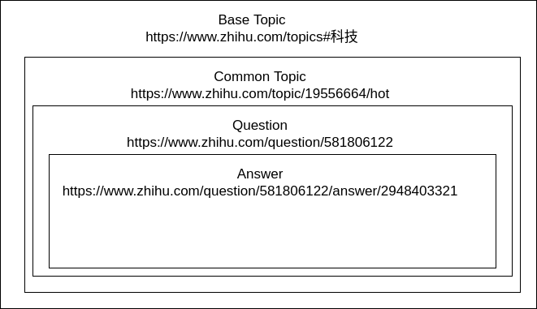
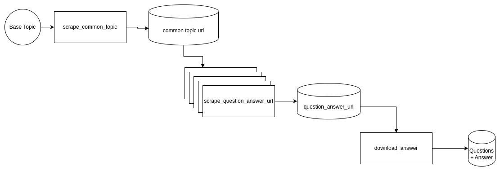

<!-- Improved compatibility of back to top link: See: https://github.com/othneildrew/Best-README-Template/pull/73 -->
<a name="readme-top"></a>
<!--
*** Thanks for checking out the Best-README-Template. If you have a suggestion
*** that would make this better, please fork the repo and create a pull request
*** or simply open an issue with the tag "enhancement".
*** Don't forget to give the project a star!
*** Thanks again! Now go create something AMAZING! :D
-->


<!-- PROJECT SHIELDS -->
<!--
*** I'm using markdown "reference style" links for readability.
*** Reference links are enclosed in brackets [ ] instead of parentheses ( ).
*** See the bottom of this document for the declaration of the reference variables
*** for contributors-url, forks-url, etc. This is an optional, concise syntax you may use.
*** https://www.markdownguide.org/basic-syntax/#reference-style-links
-->


<!-- PROJECT LOGO -->
<br />
<div align="center">


  <h3 align="center">Data Scraping Project for Zhihu Dataset</h3>

  <p align="center">
     <!-- Improved compatibility of back to top link: See: https://github.com/othneildrew/Best-README-Template/pull/73 -->
<a name="readme-top"></a>
<!--


<!-- PROJECT LOGO -->
<br />
<div align="center">


  <p align="center">
    A simple project to scrape data from Zhihu. 
    <br />
    <!-- <a href="https://github.com/othneildrew/Best-README-Template"><strong>Explore the docs »</strong></a> -->
    <br />
    <br />
    <!-- <a href="https://github.com/othneildrew/Best-README-Template">View Demo</a>
    ·
    <a href="https://github.com/othneildrew/Best-README-Template/issues">Report Bug</a>
    ·
    <a href="https://github.com/othneildrew/Best-README-Template/issues">Request Feature</a> -->
  </p>
</div>


<!-- ABOUT THE PROJECT -->
## About The Project
This project provides a way to scrape data from Zhi Hu site. We use this project to scrape dataset for Open Assistant LLM project (https://open-assistant.io/).

Use the `scrape_process.py` to get started.

<p align="right">(<a href="#readme-top">back to top</a>)</p>


### Built With
The project in is Python.
We primarily use 
* [Playwright](https://playwright.dev/) as headless browser,  
* [Ray](https://www.ray.io/) for parallel processing
* [BeautifulSoup](https://www.crummy.com/software/BeautifulSoup/bs4/doc/) for html extraction
* [DuckDB](https://duckdb.org/) for data persistance 


<p align="right">(<a href="#readme-top">back to top</a>)</p>


<!-- GETTING STARTED -->
## Getting Started


### Installation

Install all dependencies
* pip
  ```sh
    pip install -r requirements.txt
  ```

* Install playwright
    ```sh
    playwright install
    ```
* Run the following commands to install necessary library if needed
```sh
sudo apt install libatk1.0-0 libatk-bridge2.0-0 libcups2 libatspi2.0-0 libxcomposite1 libxdamage1 libxfixes3 libxrandr2 libgbm1 libxkbcommon0 libpango-1.0-0 libcairo2 libasound2
```

## Useful concept
To understand how we scrape data from Zhi Hu,
it is useful to define the hierarchy of question-answer categorization. 
Currently we work on 4 level of abstraction categorization. 
Each level of abstraction contains multiple different instance of abstraction in the next level, i.e. 1 Common Topic might contains hundreds of unique questions and 1 question can contain hundreds of unique answers.An example of such categorization is shown below.


Currently, the scraping process consists of 3 independent scraping process that scrapes 3 different level of categorization. 
Each scraping process are independent of each other and only requires input from local files to start working.
We provide a list of base topic to initialise the scraping process. The first process scrape_common_topic will scrape common topic for all base topic. All common topic will be saved periodically to local file system.
The second process is the heaviest process in the system as it utilized headless browser to scrape answer url. 
This process also utilize ray for parallel processing to speed up the entire chain of processes. The question-answer-url will be saved periodically to local file system. The last process aims to download the exact answer using API request. Shadow socks 5 proxies are used to bypass API rate limit. The extracted answers will be persisted into database. 




<!-- ROADMAP -->
## Roadmap

- [x] Decouple all scraping processes
- [x] Add Ray For Parallel Processing
- [x] Add shadow socks for API rate limit bypass
- [x] Add duckdb for persistence  
- [ ] Scrape comment sections
- [ ] Scale up scraping processes


<!-- LICENSE -->
## License

Distributed under the MIT License. See `LICENSE.txt` for more information.

<p align="right">(<a href="#readme-top">back to top</a>)</p>


